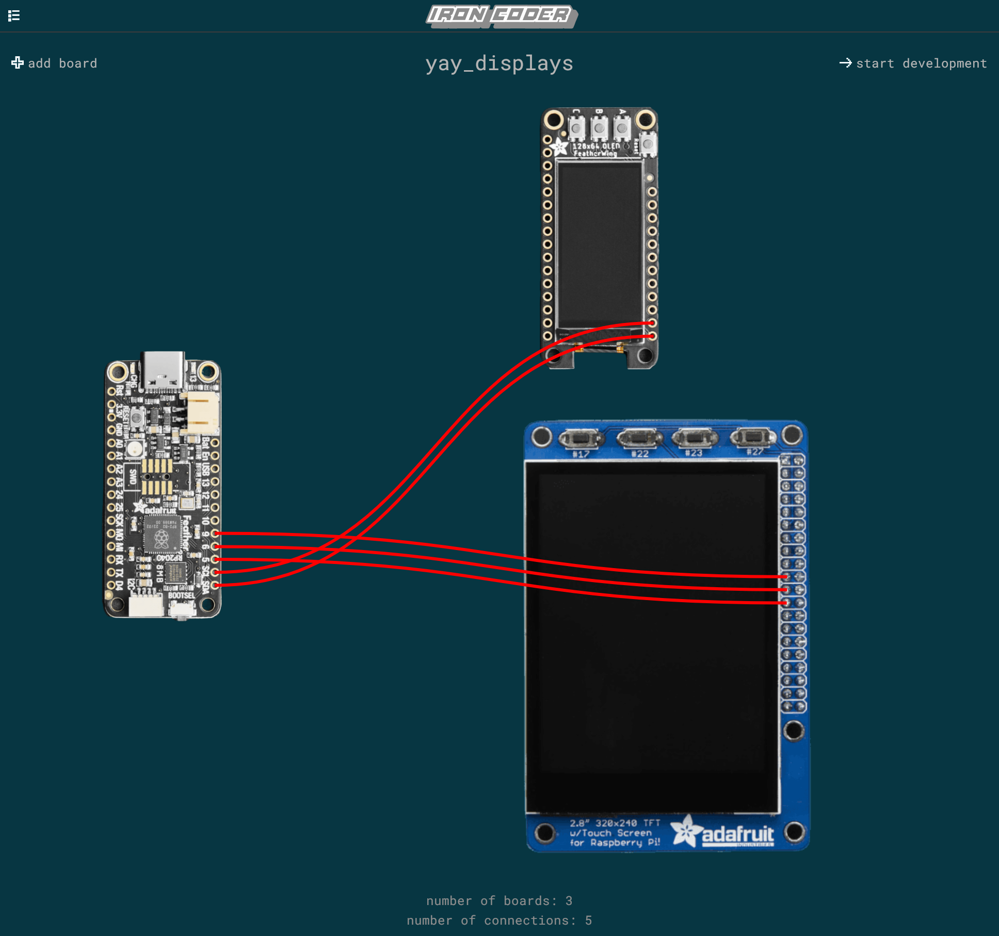

# Iron Coder
An embedded Rust IDE with an emphasis on a fun and insightful coding experience

#### By Carsten Thue-Bludworth, 2023

## Concept
Rust is a powerful and growing programming language. With a focus on safety and performance, it is an evolution in the ecosystem of systems programming. This project has a few inspirations and goals:
* Help me learn and hone skills in developing a professional application in Rust
* Serve as a playground to experiment with the hardware-software interface
* Set a foundation for benchmarking and analyzing the performance of hardware-software systems
* Engage newcomers to Rust and/or embedded development, and build a community similar to Arduino

## Project Structure
This repository contains the code and documentation for Iron Coder.
* The [docs](./docs/) folder contains conventional documentation
* The [mindmap](./mindmap/) folder contains Obsidian/Excalidraw brainstorming and notes
* The [src](./src/) folder contains the Rust code for the application

## Architecture
The following tools are used:
* `egui` for the GUI toolkit
* TODO